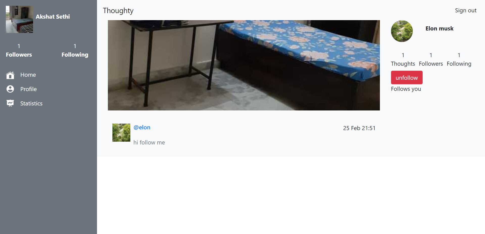

# Thoughty

> A thoughts sharing website, like twitter.

This is a twitter like website, in which you can share thoughts with ytour followers.

## Built With

- Ruby
- Rails
- Postgresql

## Live Demo

[Live Demo Link](https://thoughty-2.herokuapp.com/)

## Getting Started
- Clone the repo `git clone git@github.com:iam-Akshat/thoughty.git`
- `cd thoughty`
- `bundle install` to install all the dependencies
- `rails db:create && rails db:migrate`
- `rails s`

### Prerequisites
- Ruby 2.7.2
- Rails 6.1
- Postgresql

### Run tests
- `rspec`

### Deployment

- To deploy you will need google cloud storage key

## Authors

👤 **Akshat**

- GitHub: [@githubhandle](https://github.com/iam-Akshat)
- Twitter: [@twitterhandle](https://twitter.com/akshatsethi)
- LinkedIn: [LinkedIn](https://linkedin.com/in/akshatsethi)

## 🤝 Contributing

Contributions, issues, and feature requests are welcome!

Feel free to check the [issues page](issues/).

## Show your support

Give a ⭐️ if you like this project!

## Acknowledgments

- Design idea by [Gregoire Vella on Behance](https://www.behance.net/gregoirevella)

